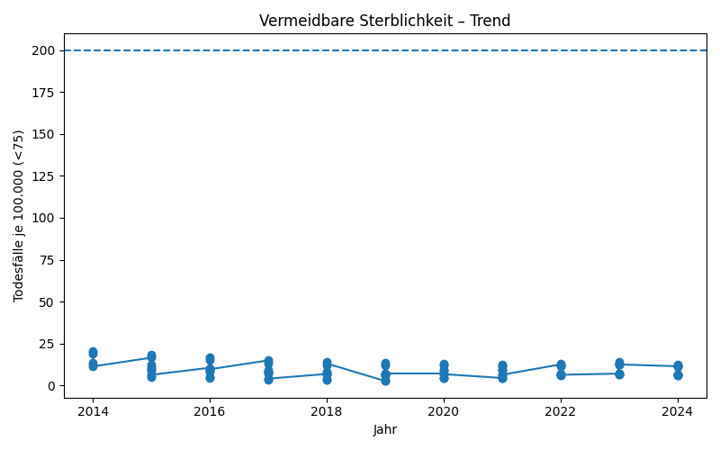
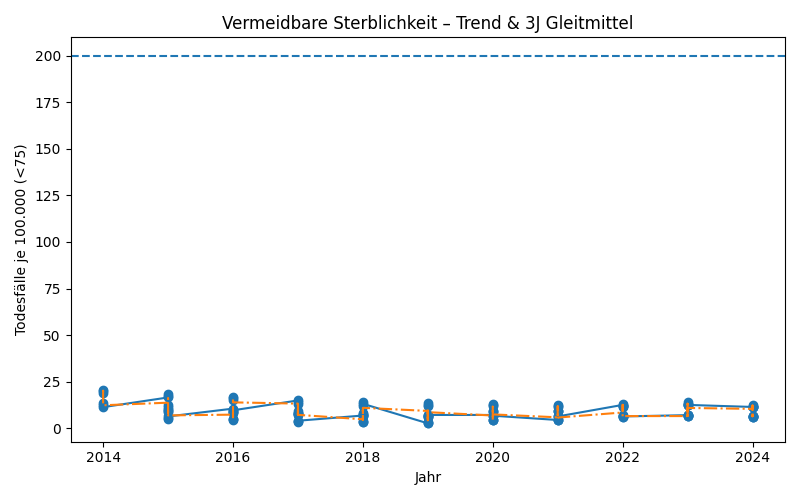
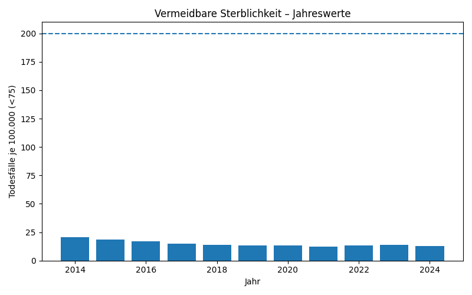

\# 🩺 Vermeidbare Sterblichkeit (Deutschland) – Indikator 3.1.a

# 🏥 Vermeidbare Sterblichkeit in Deutschland (Indikator 3.1.a)

Dieses Projekt untersucht die **vermeidbare Sterblichkeit** in Deutschland – also Todesfälle unter 75 Jahren, die durch **Prävention** (Vorbeugung) oder **Behandlung** (medizinische Versorgung) hätten verhindert werden können.  
Der Indikator ist Teil der **Deutschen Nachhaltigkeitsstrategie** und verknüpft mit den **Sustainable Development Goals (SDG 3: Gesundheit & Wohlergehen)**.

---

## 🎯 Ziel
- Politisches Ziel: **Reduktion auf höchstens 200 Todesfälle je 100.000 Einwohner:innen bis 2030**.  
- Status 2021: ❗️ Ziel *nicht erreicht*, Trend zuletzt **ungünstig (Gewitter-Bewertung)**.

---

## 📊 Visualisierungen

### 1️⃣ Entwicklung über die Zeit

- Der Indikatorwert ist im Mittel der letzten Jahre **gestiegen** statt gesunken.  
- Die rote Linie markiert das Ziel für 2030 (≤ 200 Todesfälle / 100.000).

---

### 2️⃣ Rolling Mean (Langfristiger Trend)

- Der geglättete Trend zeigt, dass wir uns **vom Ziel entfernen**.  

---

### 3️⃣ Unterschiede zwischen Geschlechtern

- Männer sind stärker betroffen als Frauen.  
- Diese Ungleichheit bleibt über die Jahre stabil.

---

## 🔎 Interpretation

- **Prävention** wird zu wenig genutzt (Vorsorge, Impfungen, Lebensstil).  
- **Behandlungen** sind oft ungleich verteilt oder kommen zu spät.  
- **Ungleichheiten**:
  - Einkommensschwache & Menschen mit geringem Bildungsgrad besonders betroffen.  
  - Regionale Unterschiede (z. B. Ost/West, Stadt/Land).  

---

## 🚦 Bewertung 2021
- Politische Ampel: 🌩️ (Gewitter)  
- Wir bewegen uns aktuell **weg vom Ziel** anstatt darauf zu.  

---

## 📂 Projektstruktur

Vermeidbare-Sterblichkeit-DE/
│
├── data/ # CSV-Dateien (Indikatordaten)
├── src/ # Python-Skripte für Analyse & Plots
│ └── make_plots.py
├── assets/ # Exportierte Plots (PNG)
├── notebooks/ # Optional: Jupyter-Notebooks
├── requirements.txt # Python-Abhängigkeiten
└── README.md # Projektdokumentation
